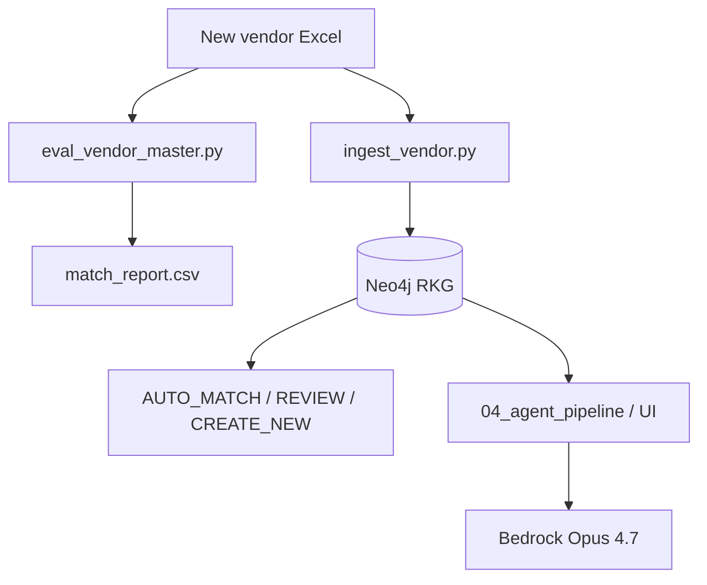

# Reflexive Knowledge Graph (RKG)

SKU master data, vendor ingestion, reflexive embeddings on Neo4j, and **Bedrock-backed agents** (Claude Opus 4.7) for investigation and matching.

For Docker/Python install and the one-time graph build sequence, see [README_setup.md](README_setup.md).

---

## What this repository does

| Capability | Entry point |
|------------|-------------|
| Load **Global SKU** master + seed Neo4j | `02_seed_data.py` |
| Compute **reflection / anomaly** signals | `03_reflection.py` |
| **Ingest a new vendor Excel** → per-row status | `ingest_vendor.py` |
| **Agent pipeline** (Supervisor → Planner → Doer → Critic) | `04_agent_pipeline.py`, `ui/app.py` |
| **API** brand/package match (+ agent + KG) | `api/main.py` → `/match`, `/match/agent` |
| **Offline** vendor vs master report (CSV only) | `scripts/eval_vendor_master.py` |
| **Synthetic** vendor QA set | `scripts/generate_synthetic_vendor.py` |

---

## Prerequisites

- Python 3.11+
- Neo4j 5.x (Docker recommended)
- Master CSV: `data/vor_sku_data.csv`
- Vendor export: Excel with the same column layout as `data/SKU_Export.xlsx` (or `sample_vendor_SKU_Export.xlsx`)
- **Amazon Bedrock** access to **Claude Opus 4.7** (required for all LLM agents — no heuristic/API-key fallback)
- AWS credentials configured (`aws configure` or environment variables)

```bash
cd reflexive_kg
python -m venv .venv
source .venv/bin/activate
pip install -r requirements.txt
cp .env.example .env   # edit Neo4j + optional Bedrock overrides
```

### Bedrock (agents)

Default model (in `config.py`):

```text
BEDROCK_MODEL_ID=anthropic.claude-opus-4-7
BEDROCK_REGION=us-east-1
```

Smoke test:

```bash
python -c "
from agents.llm import get_llm, bedrock_model_label
print(bedrock_model_label())
print(get_llm().complete('Reply with exactly: BEDROCK_OK', max_tokens=32))
"
```

Enable **Claude Opus 4.7** in AWS Console → Bedrock → Model access. If the base model ID fails, try `BEDROCK_MODEL_ID=us.anthropic.claude-opus-4-7` in `.env`.

---

## One-time graph setup

Run once (or after wiping Neo4j). Full commands: [README_setup.md](README_setup.md).

```bash
python 01_schema.py
python 02_seed_data.py
python 03_reflection.py --label GlobalSKU
python 05_synthesize_lifecycle.py --cohort 300   # demo cohort + planted anomalies
```

---

## Use cases

### 1. Process a new vendor SKU Excel (primary operations path)

Use this when you receive a **new client vendor file** and need **per-SKU status** against the Global SKU graph.

**Input:** Vendor `.xlsx` in the same schema as `data/SKU_Export.xlsx` (warehouse, Product ID, Brand, Product Description, UPC columns, dimensions, etc.).

**Prerequisites:** Steps in [One-time graph setup](#one-time-graph-setup) completed; Neo4j running.

```bash
# Ingest your file (path can be anywhere)
python ingest_vendor.py data/MyNewVendor_Export.xlsx

# Re-print summary of the last run
python ingest_vendor.py --report
```

**Console report** (end of ingest) includes counts for:

| Status | Meaning |
|--------|---------|
| **AUTO_MATCH** | Confidence ≥ 0.90 — `MAPS_TO` edge created to a GlobalSKU (UPC / ANN / brand-block signals). |
| **REVIEW_QUEUE** | Confidence 0.65–0.90 — `MatchCandidate` node; human must approve or reject. |
| **CREATE_NEW** | Confidence &lt; 0.65 — `GlobalSKUDraft` for analyst review (no auto link). |
| **UNCHANGED** | Same `product_id` already in graph with identical key fields — no rematch. |

**Delta types** (before routing): `NEW`, `FIELD_UPDATE`, `UNCHANGED`, `UPC_CONFLICT` (existing row maps to a different GlobalSKU UPC).

**Review workflow:**

```bash
python ingest_vendor.py --review-queue
python ingest_vendor.py --approve <product_id>
python ingest_vendor.py --reject <product_id>
```

**Large files** (skip post-merge anomaly pass):

```bash
python ingest_vendor.py data/MyNewVendor_Export.xlsx --skip-validation
```

**Change default paths** in `config.py`:

```python
GLOBAL_SKU_CSV  = "data/vor_sku_data.csv"
VENDOR_SKU_XLSX = "data/SKU_Export.xlsx"   # default for scripts only
```

`ingest_vendor.py` always takes the Excel path as a **CLI argument**; you do not need to copy the file to `data/` unless you want to.

---

### 2. Offline vendor vs master report (no Neo4j)

Quick CSV evaluation against the master catalog only (UPC lookup + optional API-style brand/package scoring). Does **not** write to Neo4j.

```bash
python scripts/eval_vendor_master.py --vendor data/MyNewVendor_Export.xlsx
# → reports/match_report.csv
python scripts/eval_vendor_master.py --vendor data/MyNewVendor_Export.xlsx --full   # slower: calls match API logic
```

Use this for a **first-pass** read before ingest, or when Neo4j is not available.

---

### 3. Synthetic vendor QA (controlled test buckets)

Generate a small vendor file with known ground truth:

```bash
python scripts/generate_synthetic_vendor.py              # 50 rows
python scripts/generate_synthetic_vendor.py --with-edges   # 74 rows (edge cases)
python scripts/test_synthetic_vendor.py --vendor data/synthetic_vendor_74.xlsx --full
python ingest_vendor.py data/synthetic_vendor_74.xlsx
```

Manifest: `data/synthetic_vendor_*_manifest.json`. Results: `reports/synthetic_vendor_test_results.csv`.

---

### 4. LLM agent pipeline (Bedrock Opus 4.7)

Four agents over the reflexive KG:

```text
Supervisor (Bedrock) → Planner (templates + Bedrock rationale) → Doer (Neo4j) → Critic (rules + Bedrock)
```

**Full generic pipeline** (Planner + generic Doer ANN/Cypher):

```bash
python 04_agent_pipeline.py --ask "Which GlobalSKUs are most at risk before model training?"
```

**Hackathon scenarios 1–6** (Supervisor + lifecycle Cypher chains + Critic; fixed demo paths):

```bash
python 04_agent_pipeline.py --scenario 1
python 04_agent_pipeline.py --scenario 4    # closed-world vs reflexive A/B
python 04_agent_pipeline.py --demo          # all six scenarios
```

| Scenario | Topic |
|----------|--------|
| 1 | Brand-mismatch cascade |
| 2 | Cross-source weak-signal fusion |
| 3 | Top-20 risk rank |
| 4 | Closed-world blind vs reflexive KG |
| 5 | Shared-SKU boundary |
| 6 | Picklist auto-map error |

**Streamlit workbench:**

```bash
streamlit run ui/app.py
```

Ask tab and scenario buttons use the same Bedrock-backed pipeline (Neo4j required).

**Tests** (Bedrock tests skip if AWS unavailable):

```bash
python -m pytest test_agents.py test_full_criteria.py -v
```

---

### 5. HTTP API — match without full ingest

```bash
uvicorn api.main:app --reload --port 8000
```

| Endpoint | LLM / Neo4j | Use |
|----------|----------------|-----|
| `POST /match` | No / CSV only | Fast string match on master CSV |
| `POST /match/agent` | Bedrock reasoning + Neo4j KG | ANN + graph signals + anomaly health |
| `GET /health` | — | `sku_count`, `neo4j_available`, `embeddings_available` |

Example:

```bash
curl -s -X POST http://localhost:8000/match/agent \
  -H "Content-Type: application/json" \
  -d '{"brand_name": "BIG RED", "package_type": "20OZ PL 1/24"}' | python -m json.tool
```

`/match/agent` does **not** replace `ingest_vendor.py` for bulk Excel; use ingest for warehouse `product_id` lifecycle and `REVIEW_QUEUE` / drafts.

---

### 6. Reflection, evaluation, and notebook

```bash
python 03_reflection.py --label GlobalSKU --top 50
python 06_evaluate.py
python 06_scale_evaluate.py --sample 5000
jupyter notebook RKG_Demo.ipynb
```

---

## Agent vs ingest: when to use which



- **ingest_vendor.py** — operational truth in the graph, review queue, drafts.
- **Agents** — explain anomalies, trace root cause, demo scenarios; Bedrock required.
- **eval_vendor_master.py** — spreadsheet-friendly report without loading Neo4j.

---

## Configuration reference

| Variable / setting | Default | Purpose |
|--------------------|---------|---------|
| `NEO4J_URI` | `bolt://localhost:7687` | Graph database |
| `GLOBAL_SKU_CSV` | `data/vor_sku_data.csv` | Master catalog |
| `VENDOR_SKU_XLSX` | `data/SKU_Export.xlsx` | Default vendor path for scripts |
| `BEDROCK_MODEL_ID` | `anthropic.claude-opus-4-7` | All agent LLM calls |
| `BEDROCK_REGION` | `us-east-1` | AWS region |
| `MATCH_AUTO_THRESHOLD` | `0.90` | Ingest auto-match |
| `MATCH_REVIEW_THRESHOLD` | `0.65` | Ingest review queue |

---

## Key design decisions

| Decision | Rationale |
|----------|-----------|
| `all-mpnet-base-v2` | Better semantics for short brand/supplier phrases |
| `brand_family` in embeddings | Human-readable vs encoded `brand_name` slug |
| `package_category_name` in embeddings | e.g. `1.5L PL 1/12` vs numeric `package_type_id` |
| Neo4j vector indexes | Single store for graph + ANN |
| Multi-UPC master join | `upc`, `each_upc`, `case_upc`, etc. on GlobalSKU |
| Bedrock-only agents | No Anthropic API key / heuristic Supervisor fallback |

---

## Troubleshooting

| Problem | What to check |
|---------|----------------|
| `LLMError` / Bedrock init failed | `pip install anthropic`, AWS creds, model access for Opus 4.7 |
| Ingest all `CREATE_NEW` | Run `02_seed_data.py`; confirm master CSV path |
| No `AUTO_MATCH` | UPC column populated; run `scripts/eval_vendor_master.py` on same file |
| Agent pipeline empty | Run `05_synthesize_lifecycle.py`; Neo4j sidebar green in UI |
| Stale SKUs in Neo4j | Wipe graph: `MATCH (n) DETACH DELETE n` then re-run setup |
| `--no-llm` removed | Agents always require Bedrock |

---

## Project layout (high level)

```text
reflexive_kg/
├── 01_schema.py … 05_synthesize_lifecycle.py   # graph build + lifecycle demo
├── 04_agent_pipeline.py                        # four-agent orchestrator
├── ingest_vendor.py                            # vendor Excel → status
├── api/main.py                                 # /match, /match/agent
├── agents/                                     # supervisor, planner, doer, critic, llm
├── data/                                       # vor_sku_data.csv, vendor xlsx, synthetic
├── scripts/                                    # eval, synthetic vendor generators
├── ui/app.py                                   # Streamlit
└── config.py                                   # paths, thresholds, Bedrock model
```
