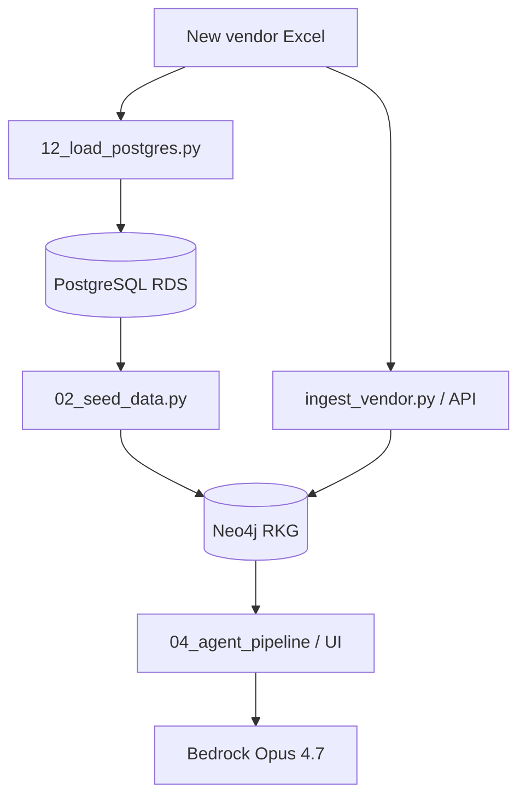

# Reflexive Knowledge Graph (RKG)

SKU master data, vendor ingestion, reflexive embeddings on Neo4j, and **Bedrock-backed agents** (Claude Opus 4.7) for investigation and matching.

For Docker/Python install and the one-time graph build sequence, see [README_setup.md](README_setup.md).

---

## What this repository does

| Capability | Entry point |
|------------|-------------|
| Load **master + tenant data** into PostgreSQL | `12_load_postgres.py` |
| Seed **Neo4j** from PostgreSQL (CSV fallback) | `02_seed_data.py` |
| Compute **reflection / anomaly** signals | `03_reflection.py` |
| **Ingest a new vendor Excel** → per-row status | `ingest_vendor.py`, API `/tenant/ingest` |
| **Agent pipeline** (Supervisor → Planner → Doer → Critic) | `04_agent_pipeline.py`, `ui/app.py` |
| **API** brand/package match (+ agent + KG) | `api/main.py` → `/match`, `/match/agent`, `/query/ask` |
| **Offline** vendor vs master report (CSV only) | `scripts/eval_vendor_master.py` |
| **Synthetic** vendor QA set | `scripts/generate_synthetic_vendor.py` |

---

## Data architecture

PostgreSQL (AWS RDS) is the **operational catalog store**. Neo4j is the **knowledge graph** used for embeddings, matching, and agent traversal.

```text
Bootstrap (one-time or refresh):
  data/vor_sku_data.csv  ──┐
  data/SKU_Export.xlsx   ──┼──► 12_load_postgres.py  ──►  PostgreSQL (RDS)
                           │         master_data
                           │         tenant_sku_data
                           │         tenant_data
                           │
Graph build:
  PostgreSQL  ──►  02_seed_data.py  ──►  Neo4j (GlobalSKU, TenantSKU, …)
```

After the initial bootstrap, **run `02_seed_data.py` without `--from-csv`** and it reads from PostgreSQL automatically when `POSTGRES_*` is configured in `.env`.

Local CSV/Excel files are still used for:
- **First load into Postgres** (`12_load_postgres.py`)
- **Fallback** when Postgres is unavailable (`02_seed_data.py --from-csv`)
- **Offline scripts** (`scripts/eval_vendor_master.py`, synthetic vendor generators)

---

## Prerequisites

- Python 3.11+
- Neo4j 5.x (Docker recommended)
- **PostgreSQL** (team AWS RDS — see `.env.example`)
- Bootstrap files (first load only): `data/vor_sku_data.csv`, `data/SKU_Export.xlsx`
- **Amazon Bedrock** access to **Claude Opus 4.7** (required for all LLM agents)
- AWS credentials configured (`aws configure`, `aws login`, or SSO)

```bash
cd reflexive_kg
python -m venv .venv
source .venv/bin/activate
pip install -r requirements.txt
cp .env.example .env   # edit Neo4j + PostgreSQL + Bedrock
```

### PostgreSQL (`.env`)

```env
POSTGRES_HOST=your-rds-host.amazonaws.com
POSTGRES_PORT=5432
POSTGRES_DB=team8_db
POSTGRES_USER=postgres
POSTGRES_PASSWORD=...              # or leave empty + POSTGRES_SECRET_ID
POSTGRES_SECRET_ID=rds!db-...      # fetched via AWS Secrets Manager
POSTGRES_SSLMODE=require
```

Fetch the RDS password (use **single quotes** in zsh — `!` in the secret id breaks double quotes):

```bash
aws secretsmanager get-secret-value \
  --secret-id 'rds!db-259bad4d-76af-44ff-8967-aa765bb03770' \
  --region us-east-1 \
  --query SecretString --output text
```

Paste the `password` field into `POSTGRES_PASSWORD` for DBeaver and local Python.

### Bedrock (agents)

Default model (in `config.py`):

```text
BEDROCK_MODEL_ID=anthropic.claude-opus-4-7
BEDROCK_REGION=us-east-1
```

Smoke test:

```bash
python -c "
from agents.llm import get_llm, bedrock_model_label
print(bedrock_model_label())
print(get_llm().complete('Reply with exactly: BEDROCK_OK', max_tokens=32))
"
```

Enable **Claude Opus 4.7** in AWS Console → Bedrock → Model access. If the base model ID fails, try `BEDROCK_MODEL_ID=us.anthropic.claude-opus-4-7` in `.env`.

---

## One-time setup

Run once (or after wiping Neo4j / Postgres). Full commands: [README_setup.md](README_setup.md).

```bash
# 1. Load catalog into PostgreSQL
python 12_load_postgres.py

# 2. Build Neo4j graph from PostgreSQL
python 01_schema.py
python 02_seed_data.py              # reads master_data + tenant_sku_data from Postgres
python 03_reflection.py --label GlobalSKU
python 05_synthesize_lifecycle.py --cohort 300   # demo cohort + planted anomalies
```

Force local files instead of Postgres (offline / no RDS):

```bash
python 02_seed_data.py --from-csv
```

Refresh tenant rows in Postgres only:

```bash
python 12_load_postgres.py --tenant-only data/new_client.xlsx
python 02_seed_data.py              # re-seed Neo4j from updated Postgres
```

---

## Use cases

### 1. Process a new vendor SKU Excel (primary operations path)

Use this when you receive a **new client vendor file** and need **per-SKU status** against the Global SKU graph.

**Input:** Vendor `.xlsx` in the same schema as `data/SKU_Export.xlsx`.

**Prerequisites:** [One-time setup](#one-time-setup) completed; Neo4j running; Postgres configured for persistence.

```bash
# Upsert into PostgreSQL + optional Neo4j ingest
python 12_load_postgres.py --tenant-only data/MyNewVendor_Export.xlsx
python ingest_vendor.py data/MyNewVendor_Export.xlsx

# Re-print summary of the last run
python ingest_vendor.py --report
```

Or via **Streamlit** → **Tenant import** tab, or **API** `POST /tenant/ingest`.

**Console report** (end of ingest) includes counts for:

| Status | Meaning |
|--------|---------|
| **AUTO_MATCH** | Confidence ≥ 0.90 — `MAPS_TO` edge created to a GlobalSKU |
| **REVIEW_QUEUE** | Confidence 0.65–0.90 — `MatchCandidate` node |
| **CREATE_NEW** | Confidence &lt; 0.65 — `GlobalSKUDraft` for analyst review |
| **UNCHANGED** | Same `product_id` already in graph with identical key fields |

**Review workflow:**

```bash
python ingest_vendor.py --review-queue
python ingest_vendor.py --approve <product_id>
python ingest_vendor.py --reject <product_id>
```

---

### 2. Offline vendor vs master report (no Neo4j)

Quick CSV evaluation against the master catalog only. Does **not** write to Neo4j or Postgres.

```bash
python scripts/eval_vendor_master.py --vendor data/MyNewVendor_Export.xlsx
python scripts/eval_vendor_master.py --vendor data/MyNewVendor_Export.xlsx --full
```

---

### 3. Synthetic vendor QA (controlled test buckets)

```bash
python scripts/generate_synthetic_vendor.py
python scripts/generate_synthetic_vendor.py --with-edges
python scripts/test_synthetic_vendor.py --vendor data/synthetic_vendor_74.xlsx --full
python ingest_vendor.py data/synthetic_vendor_74.xlsx
```

---

### 4. LLM agent pipeline (Bedrock Opus 4.7)

```text
Supervisor (Bedrock) → Planner → Doer (Neo4j) → Critic
```

**Hackathon scenarios 1–6:**

```bash
python 04_agent_pipeline.py --scenario 1
python 04_agent_pipeline.py --scenario 4    # closed-world vs reflexive A/B
python 04_agent_pipeline.py --demo
```

| Scenario | Topic |
|----------|--------|
| 1 | Brand-mismatch cascade |
| 2 | Cross-source weak-signal fusion |
| 3 | Top-20 risk rank |
| 4 | Closed-world blind vs reflexive KG |
| 5 | Shared-SKU boundary |
| 6 | Picklist auto-map error |

**Streamlit workbench:**

```bash
streamlit run ui/app.py
```

**Tests:**

```bash
python -m pytest test_agents.py test_full_criteria.py -v
```

---

### 5. HTTP API

```bash
uvicorn api.main:app --reload --port 8000
```

| Endpoint | Use |
|----------|-----|
| `POST /query/ask` | NL question → agent pipeline |
| `POST /tenant/ingest` | Upload tenant Excel (async) |
| `POST /match` | Fast string match (in-memory master CSV at startup) |
| `POST /match/agent` | Agent match with Neo4j KG |
| `GET /health` | Neo4j, Postgres, and SKU counts |

Example:

```bash
curl -s -X POST http://localhost:8000/query/ask \
  -H "Content-Type: application/json" \
  -d '{"question": "Why did model accuracy degrade after the recent customer import?"}' \
  | python -m json.tool
```

---

### 6. Reflection, evaluation, and notebook

```bash
python 03_reflection.py --label GlobalSKU --top 50
python 06_evaluate.py
python 06_scale_evaluate.py --sample 5000
jupyter notebook RKG_Demo.ipynb
```

---

## Agent vs ingest: when to use which



- **12_load_postgres.py** — persist master + tenant catalog in RDS.
- **02_seed_data.py** — build / refresh Neo4j from Postgres.
- **ingest_vendor.py** — operational per-row match status, review queue, drafts.
- **Agents** — explain anomalies, trace root cause, demo scenarios.

---

## Configuration reference

| Variable / setting | Default | Purpose |
|--------------------|---------|---------|
| `NEO4J_URI` | `bolt://localhost:7687` | Graph database |
| `POSTGRES_HOST` | *(required for Postgres path)* | AWS RDS host |
| `POSTGRES_DB` | `team8_db` | Catalog database |
| `POSTGRES_PASSWORD` | *(or Secrets Manager)* | RDS auth |
| `POSTGRES_SSLMODE` | `require` | TLS for RDS |
| `GLOBAL_SKU_CSV` | `data/vor_sku_data.csv` | Bootstrap master file |
| `VENDOR_SKU_XLSX` | `data/SKU_Export.xlsx` | Bootstrap tenant file |
| `BEDROCK_MODEL_ID` | `anthropic.claude-opus-4-7` | All agent LLM calls |

---

## PostgreSQL tables

| Table | Contents |
|-------|----------|
| `master_data` | Global SKU catalog (from `vor_sku_data.csv`) |
| `tenant_sku_data` | Per-tenant product rows (from Excel imports) |
| `tenant_data` | One aggregate row per tenant/warehouse |

Inspect with DBeaver using the RDS host, `team8_db`, SSL **require**, and the password from Secrets Manager.

---

## Troubleshooting

| Problem | What to check |
|---------|----------------|
| `PostgreSQL connection failed` | `POSTGRES_*` in `.env`, AWS creds for Secrets Manager, RDS security group allows your IP |
| `zsh: event not found: db` | Use single quotes around the Secrets Manager secret id |
| `master_data is empty` | Run `python 12_load_postgres.py` before `02_seed_data.py` |
| Neo4j seed uses CSV unexpectedly | Postgres unreachable — fix connection or pass `--from-csv` |
| `LLMError` / Bedrock init failed | AWS creds, model access for Opus 4.7 |
| Agent pipeline empty | Run `05_synthesize_lifecycle.py`; Neo4j sidebar green in UI |
| `POST /ask` returns 404 | Correct path is `POST /query/ask` |
| Stale graph | Wipe Neo4j: `MATCH (n) DETACH DELETE n` then re-run setup |

---

## Project layout (high level)

```text
reflexive_kg/
├── 12_load_postgres.py                         # CSV/Excel → PostgreSQL
├── 01_schema.py … 05_synthesize_lifecycle.py   # Neo4j build + lifecycle demo
├── 02_seed_data.py                             # PostgreSQL → Neo4j seed
├── 04_agent_pipeline.py                        # four-agent orchestrator
├── ingest_vendor.py                            # vendor Excel → status
├── api/main.py                                 # REST API
├── data/postgres_store.py                      # Postgres schema + upserts
├── agents/                                     # supervisor, planner, doer, critic
├── ui/app.py                                   # Streamlit workbench
└── config.py                                   # paths, thresholds, Bedrock
```
